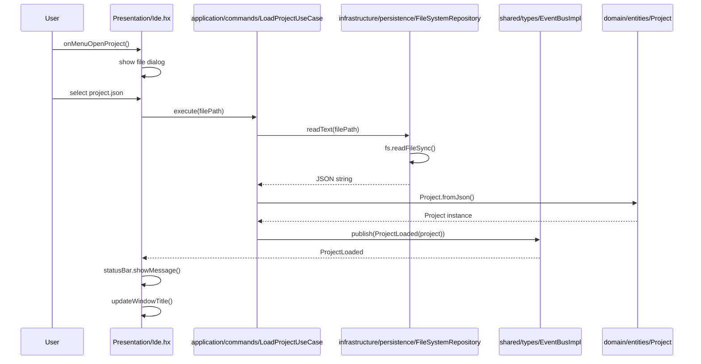
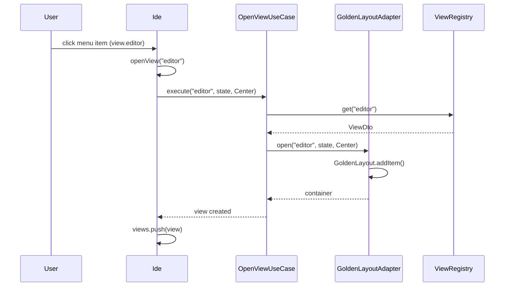
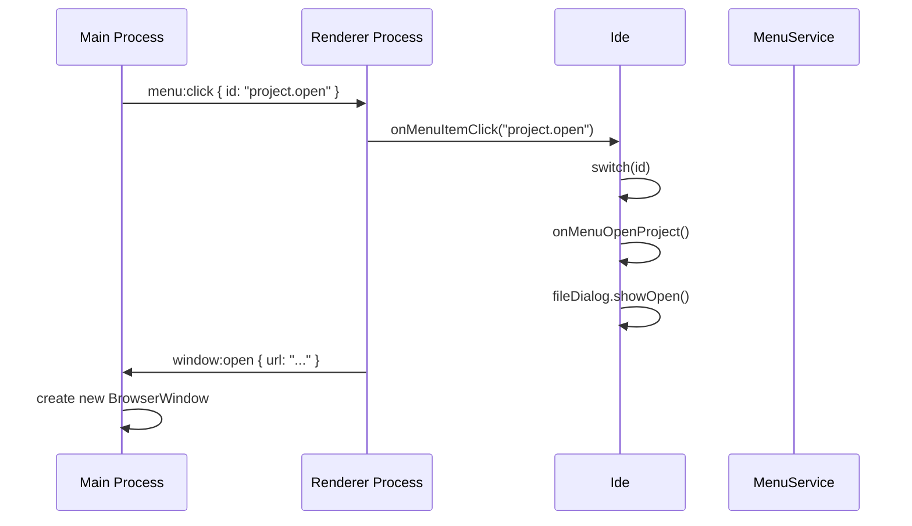

# Архитектура проекта HIDE IDE

## 📋 Обзор

**HIDE IDE** — это кроссплатформенная интегрированная среда разработки для игровых проектов на Haxe/Heaps, построенная на архитектуре **Clean Architecture** с разделением слоёв по принципу Dependency Rule.

- **Язык**: Haxe 4.x → компиляция в JavaScript/HTML/CSS
- **Платформы**: Electron (основная), NW.js (legacy), Web (браузер)
- **UI Framework**: GoldenLayout (док-панели), jQuery, Monaco Editor
- **Библиотеки**: Heaps (h3d, hxd), Spectrum (цвета), Font Awesome

---

## 🏗️ Архитектурные слои

### 🔷 Domain Layer (Бизнес-логика)

**Правило**: 0 зависимостей от внешних библиотек (`js.*`, `electron.*`, `nw.*`). Чистая логика предметной области.

| Файл | Назначение | Зависимости |
|------|------------|-------------|
| `domain/entities/Project.hx` | Сущность проекта: ID, имя, корневой путь, ресурсы | `FilePath`, `Resource`, `ResourceType` |
| `domain/entities/Resource.hx` | Сущность ресурса: ID, тип, путь, метаданные | `FilePath`, `ResourceType`, `ResourceId` |
| `domain/entities/Database.hx` | Сущность базы данных проекта | — |
| `domain/entities/UserSettings.hx` | Пользовательские настройки | — |
| `domain/entities/LayoutConfig.hx` | Конфигурация макета интерфейса | `LayoutState`, `DisplayPosition` |
| `domain/valueobjects/FilePath.hx` | Типобезопасный путь к файлу | — |
| `domain/valueobjects/ResourceId.hx` | Идентификатор ресурса | — |
| `domain/valueobjects/WindowBounds.hx` | Границы окна (x, y, width, height) | — |
| `domain/valueobjects/ScreenBounds.hx` | Границы экрана | — |
| `domain/valueobjects/DisplayPosition.hx` | Позиция отображения (Left, Center, Bottom, Right) | — |
| `domain/valueobjects/LayoutState.hx` | Состояние макета GoldenLayout | — |
| `domain/enums/ResourceType.hx` | Типы ресурсов: `Texture`, `Model`, `Shader`, `Sound` | — |
| `domain/enums/ViewType.hx` | Типы view: `Editor`, `Project`, `Database` | — |
| `domain/enums/MenuItemType.hx` | Типы пунктов меню: `Normal`, `Separator`, `Checkbox` | — |
| `domain/enums/WindowEvent.hx` | События окна: `Focus`, `Blur`, `Resize`, `Close` | — |
| `domain/exceptions/FileNotFoundError.hx` | Исключение: файл не найден | — |
| `domain/exceptions/ProjectLoadError.hx` | Исключение: ошибка загрузки проекта | — |
| `domain/exceptions/ResourceNotFoundError.hx` | Исключение: ресурс не найден | — |
| `domain/exceptions/InvalidConfigError.hx` | Исключение: неверная конфигурация | — |
| `domain/services/IFileSystem.hx` | **Порт**: интерфейс файловой системы | `FilePath`, `FileNotFoundError` |
| `domain/services/IWindowManager.hx` | **Порт**: управление окном | `WindowBounds`, `WindowEvent` |
| `domain/services/ILayoutEngine.hx` | **Порт**: движок макета | `LayoutState`, `DisplayPosition` |
| `domain/services/IResourceLoader.hx` | **Порт**: загрузка ресурсов | `Project`, `Resource` |
| `domain/services/IClipboardService.hx` | **Порт**: работа с буфером обмена | — |

---

### 🟩 Application Layer (Сценарии использования)

**Правило**: Зависит только от `domain/` и `shared/`. Оркестрация бизнес-логики.

| Файл | Назначение | Зависимости |
|------|------------|-------------|
| `application/commands/LoadProjectUseCase.hx` | Пользовательский сценарий: загрузка проекта | `IFileSystem`, `IResourceLoader`, `IEventBus`, `ProjectLoaded`, `ErrorOccurred` |
| `application/commands/SaveLayoutUseCase.hx` | Сохранение макета | `ILayoutEngine`, `IEventBus`, `LayoutSaved` |
| `application/commands/OpenViewUseCase.hx` | Открытие view-панели | `ILayoutEngine`, `ViewRegistry` |
| `application/commands/CloseProjectUseCase.hx` | Закрытие проекта | `ILayoutEngine`, `IEventBus`, `ProjectClosed` |
| `application/commands/AddRecentProjectUseCase.hx` | Добавление в недавние | `MenuService`, `IEventBus`, `RecentProjectsUpdated` |
| `application/commands/ClearRecentProjectsUseCase.hx` | Очистка недавних | `MenuService`, `IEventBus` |
| `application/commands/ExportDatabaseUseCase.hx` | Экспорт базы данных | — |
| `application/commands/BuildProjectUseCase.hx` | Сборка проекта | — |
| `application/dto/MenuItem.hx` | DTO для пункта меню | — |
| `application/dto/ViewDto.hx` | DTO для view: `name`, `label`, `icon`, `defaultState` | — |
| `application/dto/WindowBoundsDto.hx` | DTO для границ окна | — |
| `application/dto/ResourceMetadataDto.hx` | Метаданные ресурса для передачи | — |
| `application/services/MenuService.hx` | Сервис меню: парсинг HTML, регистрация команд | `MenuItemDto`, `IClipboardService` |
| `application/services/WindowService.hx` | Сервис окна: управление размером, позицией | `IWindowManager` |
| `application/services/ProjectService.hx` | Сервис проекта: управление проектами | `Project`, `IFileSystem` |
| `application/services/ResourceService.hx` | Сервис ресурсов: загрузка, кэширование | `IResourceLoader` |
| `application/services/ViewRegistry.hx` | Регистратор view-компонентов | `ViewDto` |
| `application/services/PluginManager.hx` | Менеджер плагинов | `ViewRegistry`, `IEventBus` |

---

### 🟥 Infrastructure Layer (Платформенные адаптеры)

**Правило**: Реализует порты из `domain/`. Содержит все вызовы `js.*`, `electron.*`, `nw.*`.

#### Платформенные адаптеры (Electron)

| Файл | Назначение | Реализует | Зависимости |
|------|------------|-----------|-------------|
| `infrastructure/platform/electron/ElectronWindowAdapter.hx` | Адаптер окна Electron | `IWindowManager` | `electron.main.BrowserWindow`, `electron.main.App` |
| `infrastructure/platform/electron/ElectronFileSystemAdapter.hx` | Адаптер файловой системы | `IFileSystem` | `js.node.fs`, `js.node.path` |
| `infrastructure/platform/electron/ElectronClipboardAdapter.hx` | Адаптер буфера обмена | `IClipboardService` | `electron.clipboard` |
| `infrastructure/platform/electron/ElectronScreenAdapter.hx` | Адаптер экрана | — | `electron.screen` |
| `infrastructure/platform/electron/ElectronShortcutAdapter.hx` | Адаптер горячих клавиш | — | — |
| `infrastructure/platform/electron/ElectronIpcBridge.hx` | Мост IPC между процессами | — | `electron.ipcMain`, `electron.ipcRenderer` |

#### Внешние библиотеки (адаптеры)

| Файл | Назначение | Зависимости |
|------|------------|-------------|
| `infrastructure/external/GoldenLayoutAdapter.hx` | Адаптер GoldenLayout | `ILayoutEngine`, `golden.Layout`, `IEventBus` |
| `infrastructure/external/MonacoEditorAdapter.hx` | Адаптер Monaco Editor | — |
| `infrastructure/external/HeapsEngineAdapter.hx` | Адаптер Heaps Engine | `h3d.Engine`, `hxd.App` |
| `infrastructure/external/jQueryElementAdapter.hx` | Адаптер jQuery для DOM | `js.jquery.JQuery` |
| `infrastructure/external/golden/*.hx` | Обёртки над GoldenLayout JS API | — |
| `infrastructure/external/monaco/*.hx` | Обёртки над Monaco TypeScript API | — |

#### Платформы (NW.js, Web)

| Файл | Назначение |
|------|------------|
| `infrastructure/platform/nwjs/NwWindowAdapter.hx` | Адаптер NW.js окна |
| `infrastructure/platform/nwjs/NwFileSystemAdapter.hx` | Адаптер NW.js файловой системы |
| `infrastructure/platform/nwjs/NwClipboardAdapter.hx` | Адаптер NW.js буфера обмена |
| `infrastructure/platform/web/BrowserWindowAdapter.hx` | Адаптер браузерного окна |
| `infrastructure/platform/web/LocalStorageAdapter.hx` | Адаптер LocalStorage |

#### Хранилища данных

| Файл | Назначение |
|------|------------|
| `infrastructure/persistence/FileSystemRepository.hx` | Репозиторий на основе файловой системы |
| `infrastructure/persistence/LocalStorageRepository.hx` | Репозиторий LocalStorage |
| `infrastructure/persistence/MemoryRepository.hx` | Репозиторий в памяти |

#### Конфигурация

| Файл | Назначение |
|------|------------|
| `infrastructure/config/PackageJsonLoader.hx` | Загрузка `package.json` |
| `infrastructure/config/UserSettingsLoader.hx` | Загрузка пользовательских настроек |
| `infrastructure/config/ProjectConfigParser.hx` | Парсинг конфигурации проекта |

---

### 🟨 Presentation Layer (UI и контроллеры)

**Правило**: Зависит от `application/`. Содержит только UI-рендеринг и обработку ввода.

| Файл | Назначение | Зависимости |
|------|------------|-------------|
| `presentation/Ide.hx` | **Главный контроллер**: инициализация DI, обработка UI-событий, подписка на события | Все Use-Cases, сервисы, UI-компоненты |
| `presentation/ui/View.hx` | Базовый класс view: `init()`, `activate()`, `destroy()` | — |
| `presentation/ui/Element.hx` | Обёртка над `js.html.Element` | — |
| `presentation/ui/MenuBuilder.hx` | Сборщик меню из DTO | `MenuItemDto` |
| `presentation/ui/StatusBar.hx` | Статус-бар внизу окна | — |
| `presentation/ui/Dialog.hx` | Базовый класс диалогов | — |
| `presentation/controllers/MenuController.hx` | Обработчик кликов меню | `MenuService`, Use-Cases |
| `presentation/controllers/KeyboardController.hx` | Обработчик клавиатуры | — |
| `presentation/controllers/DragDropController.hx` | Обработчик drag-and-drop | — |
| `presentation/views/ModelView.hx` | Панель просмотра 3D-моделей | `View<T>`, `HeapsEngineAdapter` |
| `presentation/views/CdbTableView.hx` | Панель базы данных | `View<T>`, `MonacoEditorAdapter` |
| `presentation/views/ScriptEditorView.hx` | Редактор скриптов | `View<T>`, `MonacoEditorAdapter` |
| `presentation/views/PrefabView.hx` | Панель префабов | — |
| `presentation/styles/Theme.hx` | Темы (Dark/Light) | — |
| `presentation/styles/CssVariables.hx` | CSS-переменные | — |

---

### ⚪ Shared Layer (Перекрывающие утилиты)

**Правило**: Используется всеми слоями. Никаких платформозависимостей.

| Файл | Назначение |
|------|------------|
| `shared/types/Result.hx` | `enum Result<T, E> { Success(T), Failure(E) }` — обработка ошибок без исключений |
| `shared/types/Option.hx` | `enum Option<T> { Some(T), None }` — альтернатива null |
| `shared/types/IEventBus.hx` | Интерфейс шины событий: `subscribe<T>()`, `publish<T>()` |
| `shared/types/EventBusImpl.hx` | Реализация EventBus (на основе Map) |
| `shared/types/NonEmptyArray.hx` | Массив, гарантированно не пустой |
| `shared/events/ProjectLoaded.hx` | Событие: загрузка проекта (`{ project: Project }`) |
| `shared/events/ProjectClosed.hx` | Событие: закрытие проекта |
| `shared/events/ViewOpened.hx` | Событие: открытие view (`{ viewName, state, position }`) |
| `shared/events/LayoutChanged.hx` | Событие: изменение макета |
| `shared/events/LayoutSaved.hx` | Событие: сохранение макета |
| `shared/events/FullscreenChanged.hx` | Событие: изменение полноэкранного режима |
| `shared/events/RendererChanged.hx` | Событие: смена рендерера |
| `shared/events/RecentProjectsUpdated.hx` | Событие: обновление списка недавних проектов |
| `shared/events/ErrorOccurred.hx` | Событие: ошибка (`{ context, error }`) |
| `shared/utils/PathUtils.hx` | Утилиты для работы с путями |
| `shared/utils/JsonUtils.hx` | Безопасный парсинг JSON |
| `shared/utils/AsyncUtils.hx` | Утилиты для асинхронных операций |
| `shared/extensions/StringExt.hx` | Расширения `String` |
| `shared/extensions/ArrayExt.hx` | Расширения `Array` |
| `shared/extensions/DateExt.hx` | Расширения `Date` |

---

## 📦 Точка входа и сборка

### Основные точки входа

| Файл | Процесс | Назначение |
|------|---------|------------|
| `ElectronMain.hx` | Main | Точка входа в Main process Electron. Запускает `AutoWindow.start()` |
| `AutoWindow.hx` | Main | Автоматический менеджер окна: загрузка `package.json`, создание `BrowserWindow`, настройка IPC |
| `app.hxml` | Renderer | Конфиг Haxe для компиляции renderer: `-main hide.presentation.Ide` |
| `main.hxml` | Main | Конфиг Haxe для компиляции main: `-main ElectronMain` |

### Сборка

```bash
# Очистка старых сборок
npm run clean

# Сборка Main process
npm run build-main   # → main.js (через haxe main.hxml)

# Сборка Renderer process
npm run build-app    # → app.js (через haxe app.hxml)

# Полная сборка
npm run build        # → main.js + app.js

# Запуск
npm start            # → electron .
```

### Выходные JS файлы

| Файл | Описание |
|------|----------|
| `main.js` | Скомпилированный Main process (ElectronMain + AutoWindow) |
| `app.js` | Скомпилированный Renderer process (Ide.hx + UI) |
| `main.js.map` / `app.js.map` | Source maps для отладки |

---

## 📄 HTML-файлы

| Файл | Назначение |
|------|------------|
| `app.html` | Главный HTML для Renderer process: загрузка jQuery, GoldenLayout, Monaco, app.js |
| `app-electron.html` | Альтернативный HTML для Electron (опционально) |
| `dbview.html` | Отдельная страница для просмотра базы данных |
| `electron_main.js` | Альтернативная точка входа на чистом JS (устаревшая) |

---

## 🧩 Плагины

| Файл | Назначение |
|------|------------|
| `plugins.json` | Конфигурация плагинов: `ConsolePlugin`, `TerminalPlugin` |
| `plugins/ConsolePlugin.hx` | Пример плагина: регистрация view "Консоль" через `ViewRegistry` |
| `plugins/console/ConsoleView.hx` | Реализация view консоли: логирование, очистка, фильтрация по уровню |

---

## 🧪 Тесты

| Путь | Тип | Примеры |
|------|-----|---------|
| `tests/unit/` | Unit-тесты | `LoadProjectCommandTest`, `FilePathTest`, `ProjectTest` |
| `tests/integration/` | Интеграционные | `ElectronIpcTest`, `FileSystemRepositoryTest` |
| `tests/e2e/` | End-to-end | `IdeStartupTest`, `ProjectLoadTest` |

---

## 🔄 Поток данных

### Загрузка проекта



### Открытие view



### Обработка клика меню



---

## 🎯 Архитектурные принципы

### Dependency Rule (Clean Architecture)

```
infrastructure/  →  application/  →  domain/
       ↑                ↑                ↑
       └────────────────┴────────────────┘
                presentation/
                       ↑
                shared/types/
```

### Запрещённые зависимости

| Слой | НЕ должен содержать |
|------|-------------------|
| `domain/` | `js.*`, `electron.*`, `nw.*`, `js.html.*`, `js.jquery.*` |
| `application/` | `js.*`, `electron.*`, `nw.*` (только через порты) |
| `infrastructure/` | **Допускается** всё платформенное |
| `presentation/` | `js.*` (DOM), `electron.*` (только через адаптеры) |

### Паттерны

- **Dependency Injection**: Контейнер сервисов в `Ide.hx`
- **Ports & Adapters**: Все внешние зависимости через интерфейсы
- **Event Bus**: Асинхронное событийное взаимодействие
- **Result<T, E>**: Обработка ошибок без исключений
- **DTO**: Передача данных между слоями
- **View Factory**: Регистрация и создание view через `ViewRegistry`

---

## 📝 Миграция с NW.js → Electron

### Статус (по слоям)

| Слой | NW.js | Electron | Статус |
|------|-------|----------|--------|
| `domain/` | ✅ | ✅ | 100% (чистый Haxe) |
| `application/` | ✅ | ✅ | 100% (через порты) |
| `infrastructure/platform/nwjs/` | ✅ | ❌ | Deprecated |
| `infrastructure/platform/electron/` | ❌ | ✅ | Full support |
| `infrastructure/external/` | ✅ | ✅ | GoldenLayout/Monaco |
| `presentation/` | ✅ | ✅ | Full support |

### Ключевые изменения

1. **Main Process**: `nw.App` → `electron.main.App`, `nw.Window` → `electron.main.BrowserWindow`
2. **IPC**: `nw.Window.get().emit()` → `ipcMain.on()` / `ipcRenderer.on()`
3. **Clipboard**: `nw.Clipboard.get()` → `electron.clipboard`
4. **Screen**: `nw.Screen.init()` → `electron.screen`
5. **Menu**: `nw.Menu` → `Menu.buildFromTemplate()` + `menu:click` event
6. **File System**: `fs.readFileSync()` напрямую → через `ElectronFileSystemAdapter`

---

## 🚀 Рекомендации по расширению

### Добавление нового Use-Case

1. Создать `application/commands/NewUseCase.hx`
2. Реализовать `execute(params): Result<T, E>`
3. Зарегистрировать в `Ide.hx` через DI-контейнер
4. Вызвать из handler'а UI (MenuController / KeyboardController)

### Добавление новой платформы (например, Web)

1. Создать `infrastructure/platform/web/WebWindowAdapter.hx`
2. Реализовать `IWindowManager` через `js.Browser.window`
3. Зарегистрировать в `Ide.hx:main()` через `#if web`

### Добавление нового view

1. Создать `presentation/views/NewView.hx: extends View<T>`
2. Зарегистрировать в `ViewRegistry.add({ name: "new", ... })`
3. Добавить пункт меню в `MenuService.addViewMenu()`

---

## 📚 Связанные документы

| Файл | Описание |
|------|----------|
| `README.md` | Общее описание проекта |
| `Structure.MD` | Краткая таблица архитектурных слоёв |
| `ClassDiagram.MD` | UML-диаграмма классов |
| `ComponentDiagram.MD` | Компонентная диаграмма |
| `DependencyGraph.MD` | Граф зависимостей |
| `SequenceDiagram.MD` | Диаграммы последовательности |
| `PackageTree.MD` | Дерево пакетов |
| `StructureTree.MD` | Дерево структуры |
| `AIAgentPrompt.MD` | Инструкции для AI-агентов по рефакторингу |

---

**Версия документа**: 1.0  
**Дата создания**: 2026-06-04  
**Ядро**: Haxe 4.3.0 + Electron 40.1.0  
**Стек UI**: GoldenLayout + Monaco Editor + jQuery 3.2.1
