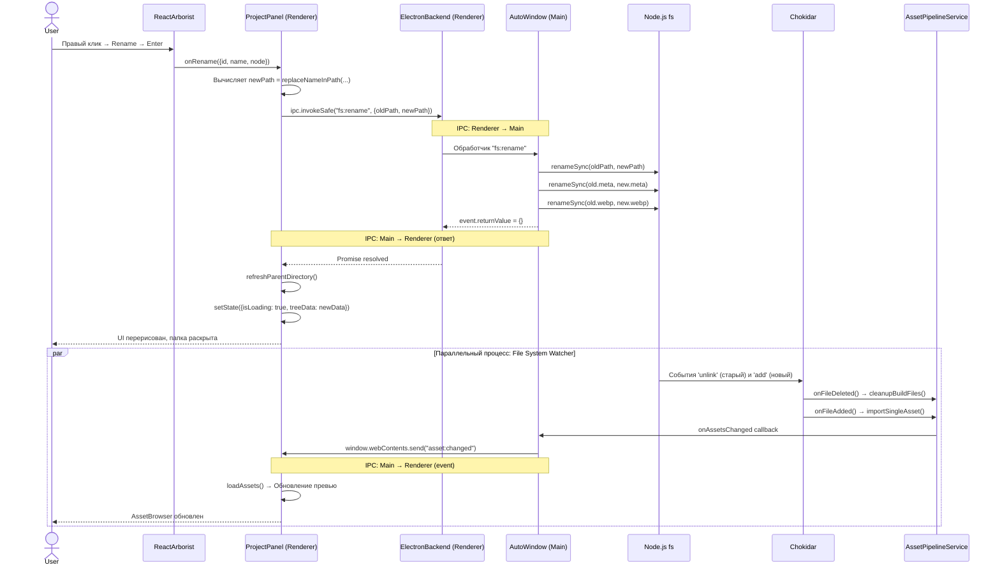

# Data Flow: Переименование файла и обновление Asset Pipeline

Эта диаграмма описывает поток данных при переименовании актива в дереве проекта, включая IPC-взаимодействие и параллельную реакцию Chokidar.

